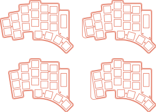

# TEMPORAL


A 36-44 key split ergonomic keyboard with wireless support. Features breakoff pinky columns and a breakoff thumb key, with an optional encoder in the thumb cluster.



## Design

### Layout

- 36-44 keys with breakoff pinky column and thumb key
- Column stagger and splay on pinky and ring columns

### Hardware

- Kailh Choc v1 low-profile switches with hotswap sockets
- nice!nano or Pro Micro compatible microcontrollers
- Optional nice!view display
- Optional EC12 rotary encoder in thumb cluster
- Wireless with battery support
- Reversible PCB

### Tools

- [Ergogen](https://ergogen.ceoloide.com/) generates the layout, PCB, plates and cases ([config.yaml](./ergogen/config.yaml))
- [KiCad](https://www.kicad.org/) v9 for via stitching and traces

## Firmware

TEMPORAL is designed to be used with ZMK. [You can find the ZMK-config repository and keymap here.](https://github.com/curbol/temporal-zmk)

## Development

### Prerequisites

- Node.js and npm
- [Homebrew](https://brew.sh/) (for installing dependencies)

### Setup

1. Install dependencies (OpenSCAD, KiCad, Inkscape, [Maple Mono NF](https://github.com/subframe7536/maple-font) font, and KiCad plugins):

```bash
make deps
```

2. Generate PCBs and cases:

```bash
make gen
```

This will:

- Run Ergogen to generate PCB and case files
- Post-process PCBs (fix edge cuts, add ground planes)
- Configure KiCad project files with defaults from `scripts/kicad_defaults.yaml`
- Generate STL case files
- Export Gerbers for manufacturing

**Note:** The main `pcbs/temporal/` PCB requires manual steps in KiCad after generation. See [pcbs/temporal/README.md](pcbs/temporal/README.md) for details.

## Build Guide

See [docs/build-guide.md](/docs/build-guide.md) for assembly instructions and ordering information.

For a complete list of components needed, see [docs/bom.md](/docs/bom.md).

## Keycaps

TEMPORAL uses Kailh Choc v1 low-profile switches. For keycaps, you can use:

- [KLP Lame Keycaps](https://github.com/braindefender/KLP-Lame-Keycaps/tree/master) - 3D printable keycap files designed for Choc switches

## Influences

TEMPORAL is inspired by and takes influence from:

- [TEMPEST](https://github.com/thrly/tempest) by thrly
- [TOTEM](https://github.com/GEIGEIGEIST/TOTEM) by GEIST
- [KLOR](https://github.com/GEIGEIGEIST/KLOR) by GEIST
