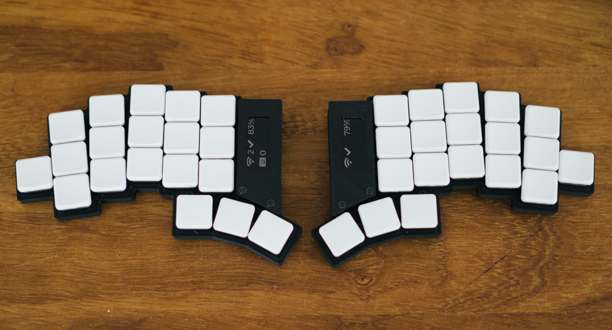
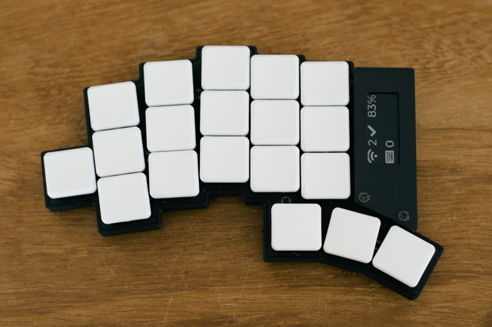
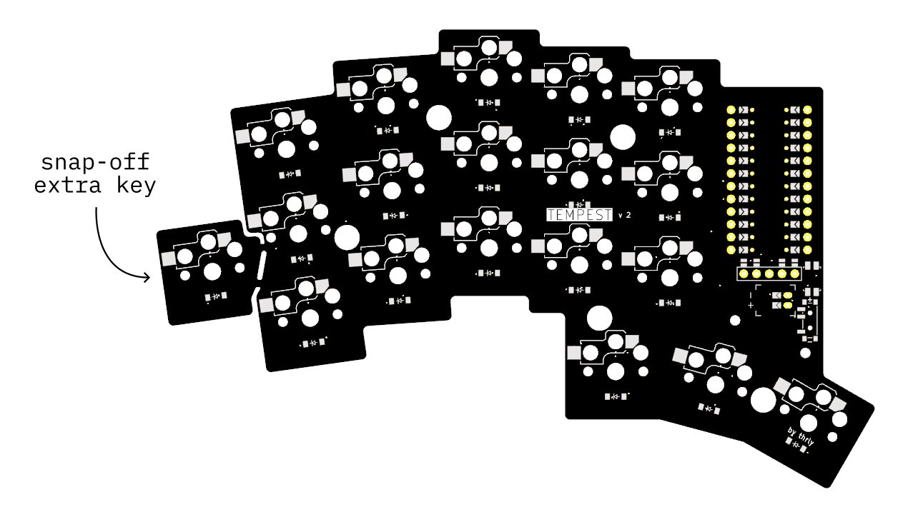
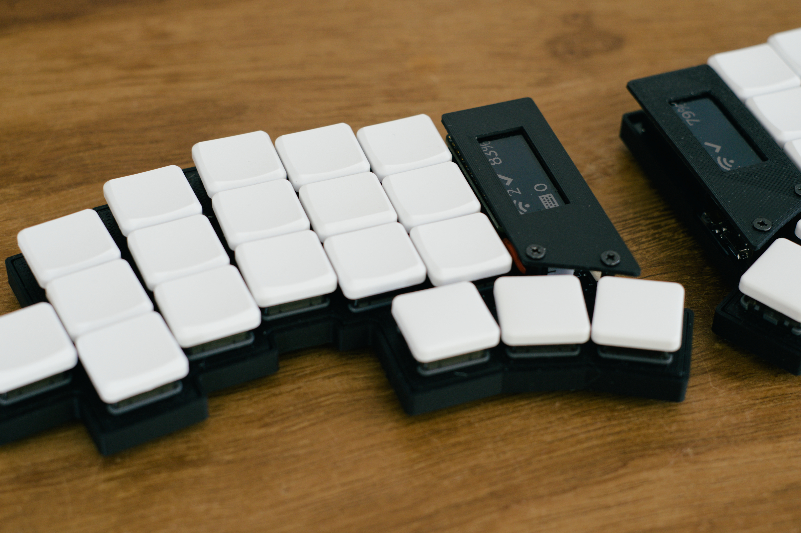
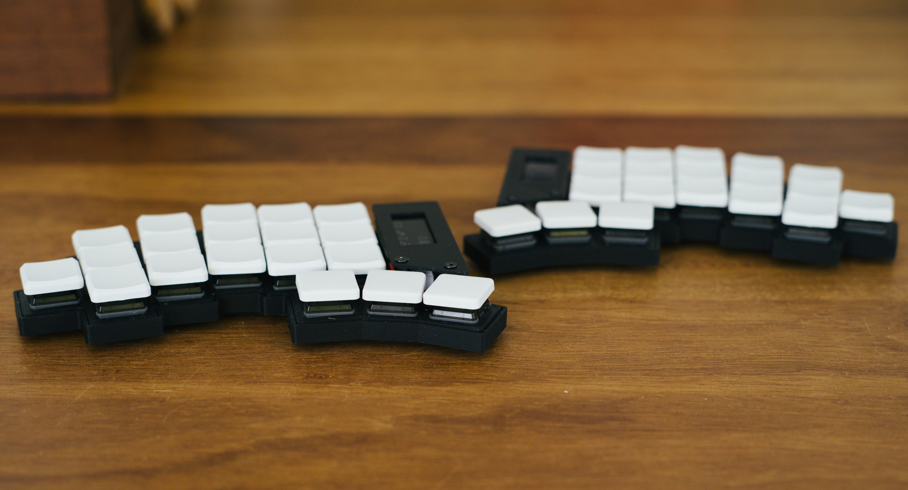
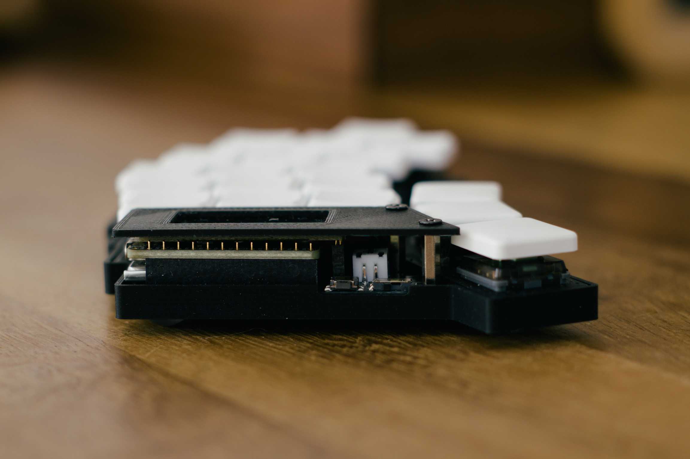

# TEMPORAL

a 36/40-key (+ encoders) split ergonomic keyboard

 

## Design

- Five columns, three rows, three thumb keys
  - Optional extra keys for 36 or 40-key configuration (snap-off pcb)
- Column stagger and splay on the pinky and ring columns
- EC12 Encoders
- Powered by nice!nano / pro micro microcontroller
- Optional nice!view display
- Designed for wireless use + battery
- Low profile v1 Choc switches + hotswap sockets
- Reversible PCB
- Uses some components (JST plug, power switch, reset) from the Typeractive Corne design
- Layout designed with [Ergogen](https://ergogen.ceoloide.com/) (see [config.yaml](./ergogen/config.yaml))
- PCB designed with [KiCad](https://www.kicad.org/) (v 9)
- Simple 3D-printable case for both 36 and 38-key layouts

## Firmware

TEMPORAL was designed to be used with ZMK. [You can find the ZMK-config repository and a keymap here.](https://github.com/thrly/tempest-zmk)

## Build Guide

[Details on the build and case can be found here.](/build-guide.md)

## Influences

TEMPORAL is inspired by and takes influence from:

- [TEMPEST](https://github.com/thrly/tempest) by thrly
- [Temper](https://github.com/raeedcho/temper) by raeedcho
- [Bad Temper](https://github.com/essFitt/Bad-Temper/tree/main) by essFitt
- [TOTEM](https://github.com/GEIGEIGEIST/TOTEM) by GEIST
- [FORAGER](https://github.com/carrefinho/forager) by carrefinho
- [Corne](https://github.com/foostan/crkbd) by foostan (and the [Typeractive](https://typeractive.xyz/) version)
- also [Chocofi](https://github.com/pashutk/chocofi), [Sweep](https://github.com/davidphilipbarr/Sweep), and others.
