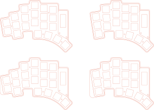
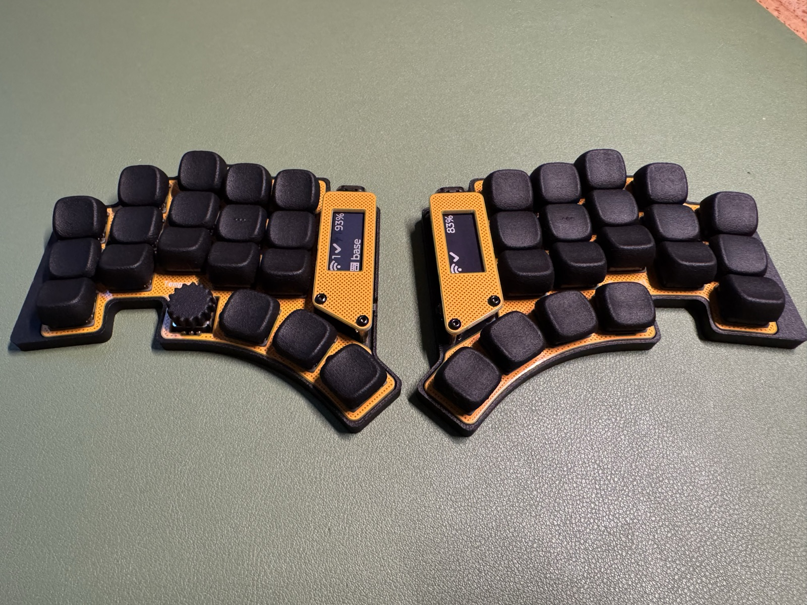
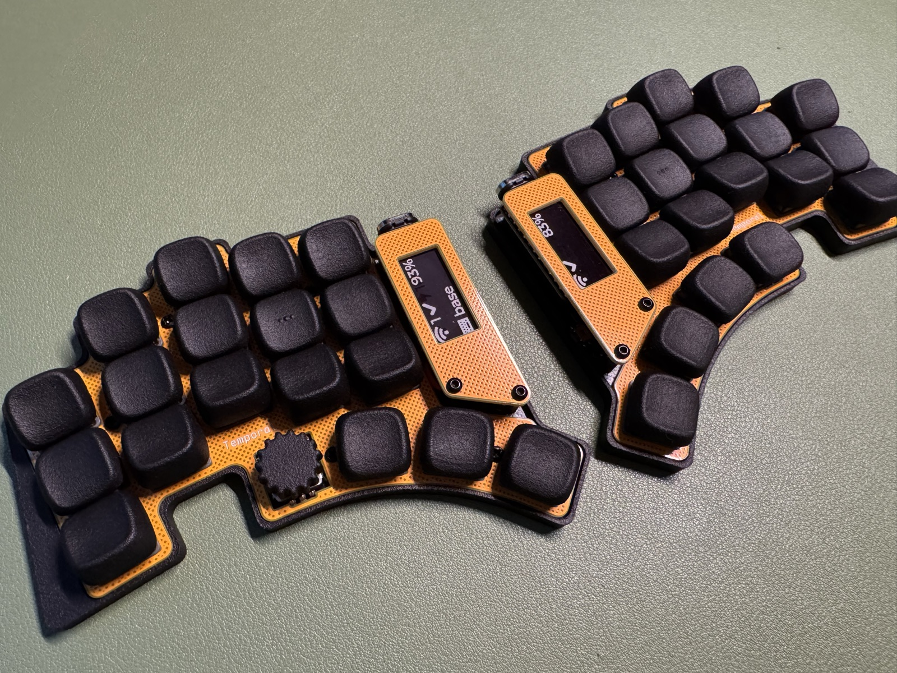

# Temporal


A 36-42 key split ergonomic keyboard with wireless support, a breakoff pinky column, and optional encoders in the thumb cluster.






## Design

### Layout

- 36-42 keys depending on configuration:
  - 42/41/40 keys (0/1/2 encoders) with full pinky column
  - 38/37/36 keys (0/1/2 encoders) with breakoff pinky column
- Column stagger and splay on pinky and ring columns

### Hardware

- Kailh Choc v1 or v2 low-profile switches, with optional hotswap sockets
- nice!nano or other Pro Micro compatible microcontrollers
- Optional nice!view display
- Optional EC11/EC12 rotary encoders in thumb cluster (up to 2)
- Wireless with battery support
- Reversible PCB
- 3D-printable cases, with an optional kickstand for tenting

### Tools

- [Ergogen](https://ergogen.ceoloide.com/) generates the layout, PCB, plates, and cases from [ergogen/config.yaml](ergogen/config.yaml)
- [KiCad](https://www.kicad.org/) v10 holds the hand-routed traces; its `pcbnew` API and `kicad-cli` drive the scripted post-processing and the exports

## Firmware

Temporal runs [ZMK](https://zmk.dev/). The shield definition and default keymap live in [temporal-zmk](https://github.com/curbol/temporal-zmk); [curbol/zmk-config](https://github.com/curbol/zmk-config) is a working config that uses it.

## Build Guide

[docs/build-guide.md](docs/build-guide.md) covers assembly and ordering. [docs/bom.md](docs/bom.md) lists every component a full build needs.

## Keycaps

Any Choc-compatible keycap fits. [KLP Lame Keycaps](https://github.com/braindefender/KLP-Lame-Keycaps) are 3D-printable and sculpted; [docs/bom.md](docs/bom.md#switches--keycaps) lists the print quantities for a full build.

## Development

### Prerequisites

- Node.js and npm
- A package manager `make deps` can drive: [Homebrew](https://brew.sh/) on macOS, or `pacman` and `yay` on Arch Linux

### Setup

1. Install dependencies (OpenSCAD, KiCad, zip/unzip, [Maple Mono NF](https://github.com/subframe7536/maple-font) font, and KiCad plugins):

```bash
make deps
```

2. Generate PCBs and cases:

```bash
make gen
```

This will:

- Run Ergogen to generate PCB and case files
- Derive `temporal.json`, the ZMK Studio physical layout, from the same points
- Post-process PCBs (edge cuts, silkscreen widths, ground planes, text keepouts,
  via stitching, zone fills, embedded fonts)
- Configure KiCad project files with defaults from `scripts/kicad_config.yaml`
- Derive the `top_plate_*_stealth` variants from the generated top plates
- Render `assets/preview.svg` and a `pcb.png` per board
- Export gerbers for manufacturing
- Generate the JLCPCB BOM and CPL files in `jlcpcb/`
- Generate STL case files

**Note:** The main `pcbs/temporal/` PCB requires manual steps in KiCad after generation. See [pcbs/temporal/README.md](pcbs/temporal/README.md) for details.

### Verifying

```bash
make check
```

Confirms the sources parse and lint, `ergogen/config.yaml` builds, every committed board passes DRC and carries its own silkscreen font, and the pours in `pcbs/` still match the custom DRC rules and the zone settings. It then regenerates each committed derived artifact and diffs it against what is checked in: `temporal.json`, `jlcpcb/`, the `.kicad_pro` and `.kicad_dru` files, the `top_plate_*_stealth` boards, and the gerber zips. This is what CI runs on every push.

## Influences

Temporal takes influence from:

- [Hillside](https://github.com/mmccoyd/hillside) by mmccoyd
- [TOTEM](https://github.com/GEIGEIGEIST/TOTEM) and [KLOR](https://github.com/GEIGEIGEIST/KLOR) by GEIST
- [TEMPEST](https://github.com/thrly/tempest) by thrly

## Support

<a href="https://ko-fi.com/curbol"></a>
