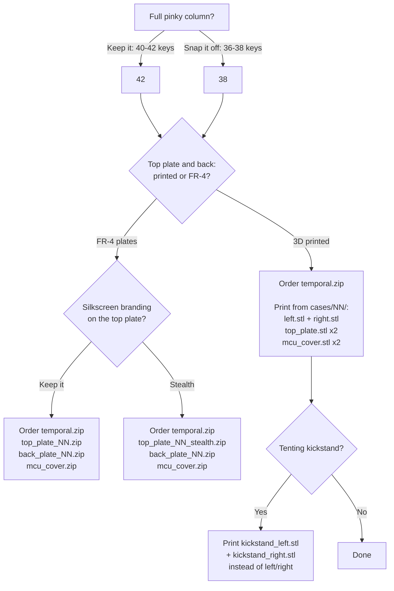

# Build Guide

Building a Temporal from bare PCBs to a flashed, working keyboard.

> [!TIP]
> [Typeractive's Corne wireless build guide](https://docs.typeractive.xyz/build-guides/corne-wireless) covers a similar board and has videos that may be helpful.

## Before You Start

### Choose Your Build

Four decisions settle everything you order and print. Only the first two change which
files you need; the switch generation and whether you socket or solder are yours to make
at assembly time, because one case covers all of them.

Gerber zips are in [`gerbers/`](/gerbers/); `NN` is your key count. Every build needs
`temporal.zip`, which is the main PCB, twice. [docs/bom.md](/docs/bom.md) lists the
components.

One 3D-printed case fits every switch and mounting combination: it carries the pockets
for Choc v1 posts, the Choc v2 centre boss and stabilizer pin, hotswap sockets, and
directly soldered switch pins all at once. At a 2.35mm floor they are all blind, so the
bottom face is solid whichever build you do.

### Key Configuration

Decide on your key configuration (36-42 keys) first. The outer pinky columns snap off the PCB if you do not want them, and each encoder replaces one key position in the thumb cluster.

**Available configurations:**

- **With full pinky column:** 42 keys, 41 keys + 1 encoder, or 40 keys + 2 encoders
- **With breakoff pinky column:** 38 keys, 37 keys + 1 encoder, or 36 keys + 2 encoders

**To remove the pinky column:**

1. Lay the PCB on a hard flat surface with the extra column hanging off the edge
2. Press down on the main PCB to hold it steady
3. Snap off the extra column by pushing down on it quickly and forcefully
4. Sand the PCB edge flat using sandpaper on a flat surface (200-400 grit works well)
5. Clean up thoroughly to remove any PCB dust and residue

> [!WARNING]
> PCB dust is toxic. Wear a mask and work in a well-ventilated area or outside. Clean up well after sanding.

### Identify Left and Right PCBs

The Temporal PCBs are reversible. Before soldering, decide which PCB will be left and which will be right. Components are soldered to opposite sides of each PCB. Look for "Back Left" or "Back Right" printed above the MCU area to confirm you're working on the correct side.

> [!CAUTION]
> Double-check your orientation before soldering. Building two of the same side is a common mistake that's difficult to fix.

### Tools Needed

- Soldering iron with fine tip
- Solder (leaded solder is easier to work with)
- Tweezers
- Flush cutters / wire snips
- Kapton tape or masking tape
- Heat-set insert tool (optional, for the 3D-printed case)

---

## Assembly Overview

Follow this general order:

1. Back side: diodes, hotswap sockets, jumpers
2. Front side: power switch, reset button
3. Front side: MCU sockets, display header, battery connector
4. Front side: encoder, if you are fitting one
5. Microcontroller and display, then clean the PCB
6. Case assembly
7. Switches and keycaps

---

## Step 1: Solder Back Components

All components in this step are soldered to the **back side** of the PCB.

### Soldering Technique

For SMD components (diodes, sockets, jumpers), use this technique:

1. Apply a small amount of solder to **one pad only**
2. Using tweezers, position the component while heating the pre-soldered pad
3. The component sinks into the molten solder; hold it in place until the solder solidifies
4. Solder the remaining pad(s), touching both the pad and component lead simultaneously

### Diodes

> [!NOTE]
> If the diodes are already installed using JLCPCB assembly, skip this step.

Install one diode per key position, 18-21 per half depending on your configuration. Diodes are directional: the line on the diode must match the line on the PCB silkscreen.

1. Pre-tin one pad of each diode location
2. Place the diode with the line matching the PCB marking
3. Heat the pre-tinned pad while holding the diode with tweezers
4. Solder the second pad

### Hotswap Sockets

Install one socket per key position, matching your diode count. Sockets fit one way only: line the chamfered corners up with the silkscreen outline.

1. Pre-tin one pad
2. Place the socket in the silkscreen outline
3. Heat and position the socket
4. Solder the second pad, using enough solder for a solid connection

> [!TIP]
> Apply gentle pressure while soldering to ensure the socket sits flat against the PCB.

> [!TIP]
> Install sockets in the encoder positions even if you are fitting encoders. They do not interfere, and leaving the position socketed keeps the option of a plain switch there later.

> [!NOTE]
> Hotswap sockets are optional. Soldering switches straight to the PCB saves their cost, at the price of desoldering to change a switch later.

### Jumpers

> [!NOTE]
> If the jumpers are already bridged with 0-ohm resistors from JLCPCB assembly, skip this step.

> [!IMPORTANT]
> Only bridge jumpers on the **BACK side** of the board. This is the same side as your diodes and hotswap sockets.

Bridge all jumper pads on the back side. There are jumpers for the MCU, display, and battery connections.

1. Apply solder to one pad
2. Add more solder while dragging across to the second pad to create a bridge
3. The bridge should be a smooth dome of solder connecting both pads

---

## Step 2: Solder Power and Reset Switches

These components are soldered to the **front side** of the PCB.

### Power Switch (MSK12C02)

> [!TIP]
> These components have multiple legs; once one is tacked down, the rest are easy.

1. Pre-tin one of the pads
2. Position the switch and heat the pre-tinned pad while holding the switch in place with tweezers
3. Solder the remaining pads

### Reset Button

1. Pre-tin one pad
2. Align the button and heat the pre-tinned pad
3. Solder the remaining pads

---

## Step 3: Solder MCU, Display, and Battery Components

These components are installed on the **front side** of the PCB. The sockets and headers use through-hole pins that are soldered from the back.

> [!TIP]
> For all through-hole components: after tacking two corner pins, verify the component is straight and fully seated before soldering the rest.

### MCU Sockets

> [!IMPORTANT]
> The microcontroller will be placed **facing DOWN** (components facing the PCB). Ensure your sockets are positioned correctly.

1. Insert the sockets into the front of the PCB
2. Tape them in place to prevent them from falling out when you flip the board

3. Flip the PCB and solder two pins on opposite corners first while pressing the socket flat against your work surface to ensure it's fully seated
4. Solder the remaining pins
5. Trim the pins flush with the solder joints using wire snips

### Display Header

1. Insert the header pins into the front of the PCB
2. Tape in place

3. Solder from the back using the same technique as the MCU sockets

4. Trim the pins

### Battery Connector

1. Insert the connector into the front of the PCB
2. Tape in place

3. Solder from the back
4. Trim the pins

> [!IMPORTANT]
> When connecting the battery later, verify polarity matches the PCB markings (+ and -). Reversed polarity can damage the microcontroller. Most 301230 or 401230 LiPo batteries with JST connectors work well.

---

## Step 4: Solder Encoder (Optional)

If you're using rotary encoders instead of switches in the thumb cluster positions:

### Encoder Installation

The encoder has side clips that snap into the PCB, so taping is not necessary.

1. Insert the encoder from the front; the clips snap into the mounting holes
2. Flip the board and solder the 3 encoder pins on the back
3. Trim the pins

### Encoders with Switch Function

If your encoder has a push-button switch (5 pins total instead of 3):

1. The 3 encoder pins are soldered through-hole as described above
2. The 2 switch pins need to be **surface mounted** on the front of the PCB
3. Bend and trim the switch pins so they can lay flat on the SMD pads
4. Solder the switch pins to the SMD pads on the front

---

## Step 5: Install the Microcontroller

### nice!nano Installation

1. Insert the mill-max pins into the sockets (not into the nice!nano yet)
2. Place the nice!nano **face down** (components facing the PCB) onto the pins
3. Solder the pins to the nice!nano

4. The nice!nano should now be removable from the sockets

### Display Installation (Optional)

If using a nice!view or other display:

1. Insert pins into the display header
2. Place the display onto the pins
3. Solder and trim

### Clean the PCB

After all soldering is complete, clean the board to remove flux residue. Flux left on the PCB can be corrosive over time and looks untidy.

1. Dip a toothbrush in isopropyl alcohol (90% or higher works best)
2. Scrub all solder joints thoroughly
3. Allow the board to dry completely before powering on

*Left: after cleaning. Right: before cleaning.*

---

## Step 6: Case Assembly

### MCU Cover

1. Attach the MCU cover using 8mm standoffs
2. Use 2 M2 screws (4mm length) from the back of the PCB into the standoffs
3. Use 2 more M2 screws (4mm length) from the front through the cover into the standoffs

### 3D-Printed Case

1. Install 5 heat-set inserts into the case posts with a soldering iron or heat-set tool

2. Place the PCB into the case; the case posts go through its mounting holes

3. Place the top plate over the PCB, aligning with the case posts

> [!TIP]
> Insert a few switches into the top plate before placing it on the PCB. This helps maintain proper spacing and alignment.

4. Secure with M2 screws (4mm length) through the top plate into the heat-set inserts

### FR-4 Plate Alternative

If using FR-4 plates instead of a 3D-printed case:

1. Attach the back plate using 3mm standoffs, which clear the 1.95mm hotswap sockets on the back of the PCB
2. Secure with M2 screws (3mm length) from both faces; longer screws meet inside a 3mm standoff and bottom out
3. Add the top plate and seat the switches through it into the hotswap sockets

---

## Step 7: Switches and Keycaps

1. Insert Choc v1 or v2 switches into the top plate
2. Press firmly until the switches click into the hotswap sockets
3. Install keycaps onto the switches
4. If using encoders, press the knobs onto the encoder shafts

---

## Flashing Firmware

Temporal runs ZMK.

### Initial Setup

1. Create a ZMK config repository by following the [ZMK User Setup Guide](https://zmk.dev/docs/user-setup)
2. Add [temporal-zmk](https://github.com/curbol/temporal-zmk) to `config/west.yml` as a shield module ([example](https://github.com/curbol/zmk-config/blob/main/config/west.yml))
3. List both halves in `build.yaml` ([example](https://github.com/curbol/zmk-config/blob/main/build.yaml))
4. [curbol/zmk-config](https://github.com/curbol/zmk-config/tree/main/config) shows the whole config together

### Keymap Editor (Optional)

[Keymap Editor](https://nickcoutsos.github.io/keymap-editor/) edits the keymap visually. Point it at the layout from [temporal-zmk](https://github.com/curbol/temporal-zmk).

### Flashing the Firmware

1. Push your config changes to GitHub
2. The GitHub Action builds the firmware automatically
3. Download the firmware artifact from the Actions tab
4. Extract the zip; it holds two `.uf2` files, one per half

### Entering Bootloader Mode

1. Double-click the reset button on the PCB
2. The nice!nano will appear as a USB drive on your computer

### Flash Each Half

1. Drag the `temporal_left-nice_nano_v2-zmk.uf2` file to the left half's drive
2. Repeat for the right half with `temporal_right-nice_nano_v2-zmk.uf2`

> [!NOTE]
> You must flash both halves on first setup. After initial pairing, keymap changes typically only require flashing the left half.

---

## Additional Resources

- [Typeractive's Corne build guide](https://docs.typeractive.xyz/build-guides/corne-wireless): a close reference for wireless split builds
- [ZMK documentation](https://zmk.dev/docs)
- [temporal-zmk](https://github.com/curbol/temporal-zmk): the ZMK shield module for this board
