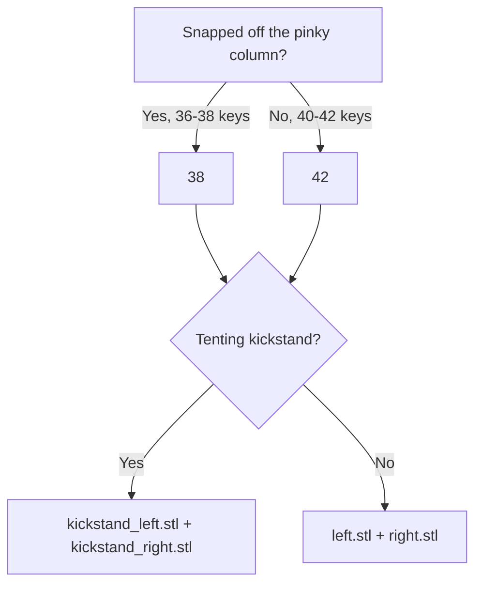

# One case for every build

## Problem

The Choc v2 boss pocket and the hotswap socket relief overlap in plan, and both cut
through the 1.95mm floor. Where their boundaries cross, the leftover material tapers
to a knife edge that stands the full height of the floor with nothing under it.

Measured from `ergogen/config.yaml`, switch-local:

- Boss pocket is a circle of `(4.8 + 0.6) / 2 = 2.7mm` (`:454`).
- Socket relief is the footprint outline plus 0.35mm (`:306-345`); its nearest corner
  sits 2.438mm from the switch centre, 0.262mm inside the pocket wall.
- The two boundaries cross at (2.150, 1.633) and (2.443, 1.150).
- Between them the wall is 0.14mm at y=1.80, 0.34mm at y=2.00, 0.70mm at y=2.30.

No clearance setting fixes this. Stripping the padding off both, the real Ø4.8 boss and
the real socket body are 0.515mm apart, so even at zero clearance the wall would be half
a millimetre. A wall there is not available.

The fix is to stop cutting through. The boss pocket needs
`choc_v2_post_d - pcb_thickness + buffer = 1.8mm` of depth; give the floor enough
material under it and the wedge becomes a rib standing on continuous floor instead of a
free-standing spike.

## Decision

One case covers every build: Choc v1 or v2, hotswap or soldered. It carries the union of
every cutout, at a floor thick enough that all of them are blind.

This works because the reason the variants existed is gone. `CLAUDE.md` records it:
*"that boss reaches 1.8mm into a 1.95mm floor, so its pocket has to go through; a v1
build would otherwise get a hole under every key for a feature its switches lack."* The
objection is entirely about the through hole. Once the pocket is blind, a v1 builder gets
a pocket 0.55mm off the bottom skin, invisible from outside and costing nothing.

Exported case keys go from 32 to 8. `cases/` goes from 32 STLs and 73MB to 8 STLs and roughly
18MB, which also cuts the binary churn every `make gen` puts into `.git`.

## Floor geometry

Nothing on the back of the PCB can exceed 1.95mm, or it would already protrude from the
bottom of the current case. That bounds every floor cutout, so the floor is the deepest
back-side feature plus a printable skin, and no cutout goes through.

```yaml
socket_depth: 1.95                            # Deepest back-side component
m2_nut_depth: m2_nut_thickness + buffer       # 1.70
floor_skin: 0.4                               # 2 layers at 0.2mm
bottom_thickness: socket_depth + floor_skin   # 2.35
```

| cutout | depth | skin |
|---|---|---|
| socket relief | `socket_depth` 1.95 | 0.40 |
| encoder plate-mount legs | `socket_depth` 1.95 | 0.40 |
| v2 boss pocket + socket bridge | `socket_depth` 1.95 | 0.40 |
| v2 corner stabilizer pocket | `socket_depth` 1.95 | 0.40 |
| MCU cover hex pockets | `m2_nut_depth` 1.70 | 0.65 |
| diode, v2 post bridge | `diode_depth` 1.25 | 1.10 |
| v1 posts, choc/socket bridge | `choc_depth` 1.15 | 1.20 |
| pins, pads, solder bridges | `pin_depth` 0.60 | 1.75 |

The v2 boss needs 1.80mm and its stabilizer pin needs only pin depth, but both are cut
at `socket_depth`. The boss is within one layer of the socket, and giving the group a
single depth means the boss pocket and the socket relief share one flat floor instead of
meeting at a 0.15mm step, and the side solder bridge reaches down into a pocket rather
than onto a ledge. `choc_v2_depth` stops existing.

The M2 insert holes are not in this table, and the reason is worth recording. Their
cutting cylinder starts 1.5mm into the floor (`:1423-1426`), but `_posts_42` is a
separate case body, so `+_shell_42` unions a solid floor back in below z=0 and the
realized hole is only as deep as the post, 2.5mm. Verified in the STL: no geometry at
z=-1.5 in the built case, nor in the old ones. `m2_insert_hole_depth: 4` is therefore
nominal rather than realized, which is a pre-existing issue and out of scope here; the
thicker floor leaves room to fix it if the hole is ever made to reach its full depth.

`_wall_cutouts` is unaffected; it sits at `wall_height`, above the floor entirely.

## Config changes

### Depth-named cutout groups

The existing groups are named by depth (`_choc_depth_cutouts`, `_diode_depth_cutouts`,
`_pin_depth_cutouts`). The through-cut groups adopt the same convention now that they
have depths of their own:

| was | becomes | extrude |
|---|---|---|
| `_socket_full_depth_cutouts_*` | `_socket_depth_cutouts_*` | `socket_depth` |
| `_choc_v2_full_depth_cutouts` | folded into `_socket_depth_cutouts_*` | `socket_depth` |
| `_choc_v2_pin_depth_cutouts_*` | folded into `_socket_depth_cutouts_*` | `socket_depth` |
| `_full_depth_cutouts` (hex pockets half) | `_m2_nut_depth_cutouts` | `m2_nut_depth` |
| `_full_depth_38` (outline) | `_encoder_legs` | folded into `_socket_depth_cutouts_*` |

`_full_depth_38` is renamed because the name describes a depth it no longer has and a
component it never was. It cuts `_choc_side_posts` at `thumb_enc`, but ceoloide's encoder
footprint puts `mounting_holes_position` at 5.6mm, the same ±5.5mm as the choc side
posts, so it is clearance for the EC11 plate-mount legs.

### Merged chains

The socket chain already subtracts `_choc_depth_38` and `_full_depth_38`, and the solder
chain's pin-depth group is a superset of the socket chain's. So the merge is the socket
chain with the solder pin-depth group swapped in and the v2 groups added:

```yaml
_temporal_42_left:
  - +_shell_42
  - +_posts_42
  - +_mcu_catch
  - -_wall_cutouts
  - -_m2_nut_depth_cutouts
  - -_diode_depth_cutouts
  - -_choc_v2_bridge_cutouts
  - -_choc_v2_bridge_pinky_cutouts
  - -_pin_depth_cutouts_left              # pins, solder reliefs and their bridges
  - -_pin_depth_pinky_cutouts_left
  - -_choc_depth_cutouts_left             # v1 posts + choc/socket bridge
  - -_choc_depth_pinky_cutouts_left
  - -_socket_depth_cutouts_left           # socket relief, encoder legs, v2 boss + stab
  - -_socket_depth_pinky_cutouts_left

temporal_42_left:
  - +_temporal_42_left

temporal_42_kickstand_left:
  - +_temporal_42_kickstand_1
  - +temporal_42_left
```

The 38 chains are the same without the `_pinky` lines. `_choc_v2_post_bridge` (`:460`)
stays as it is; it joins the boss pocket to the diode pocket, which is a separate
adjacency from the socket one.

### Bridging the crossings

Three places in the per-key cutout set have two pocket boundaries crossing at a shallow
angle, which leaves a sliver of material tapering to nothing rather than a wall. All
three get the same treatment: a rectangle spanning the full width of one of the shapes,
reaching into the other, so the crossing is removed instead of relocated. A bridge sized
only to the visible sliver moves the taper to wherever its own edge cuts the neighbour.

| crossing | overlap | bridge |
|---|---|---|
| v2 boss pocket / socket relief | 0.26mm | the pocket's socket-facing quadrant, `choc_v2_pocket_r` wide and up to `socket_top_block_y` |
| middle solder relief / diode | 0.09mm | `solder_pin_w` wide, from `solder_mid_y` up to `diode_y` |
| side solder relief / v2 stabilizer | 0.75mm | `choc_v2_stab_w + cutout_padding` wide, from `solder_side_y` down to `choc_v2_stab_y` |

Each bridge is cut at the shallower of the two depths it joins, which is all the height
the sliver has: below that the shallower pocket's floor is solid and the region is
continuous with it. The boss bridge is therefore at `socket_depth` and both solder
bridges at `pin_depth`. `_choc_v2_post_bridge` already worked this way for the boss and
the diode, joining at `diode_depth`.

Measured as material whose local width is under 0.4mm, in a window around each crossing:

| junction | before | after |
|---|---|---|
| boss / socket | 0.0547 mm² | 0.0381 mm² |
| middle solder / diode | 0.2496 mm² | 0.1523 mm² |
| side solder / stabilizer | 0.0453 mm² | 0.0000 mm² |

What remains in the first two is not sliver. The metric flags any convex corner of bulk
floor, and the residue is the right-angle corners where the diode meets its pads and
where a bridge edge meets a pocket edge. Those are present before and after, and a 90°
corner is a corner, not a finger. The tapers themselves are gone: without the middle
bridge there is a band between the solder stadium's arc and the diode's lower edge that
runs from 0.00mm at x=0.66 to 0.40mm at x=1.11; with it the void is a clean
-1.25 to 1.25 column from the pin up into the diode.

The boss bridge lives in `_choc_v2_center_post_<hand>` rather than a family of its own,
which is why that outline is hand-specific. The two solder bridges are
`_solder_mid_bridge` (hand-agnostic, the pin is on the centre line) and
`_solder_side_bridge_<hand>`.

Every coordinate is an anchor, so the bridges follow the shapes they join:

```yaml
  socket_block_x: 2.15       # Socket bottom block, edge nearest the switch centre
  socket_block_y: 1.15       # Socket bottom block, lower edge
  socket_top_block_y: 3.35   # Socket top block, lower edge
  choc_v2_pocket_r: (choc_v2_center_post_w + cutout_padding) / 2
  solder_pin_r: 1
  solder_pin_dx: 0.25
  solder_pin_w: 2 * (solder_pin_dx + solder_pin_r)
  solder_mid_y: -5.9
  solder_side_x: 5
  solder_side_y: -3.8
```

The socket anchors are also used by `_socket_*_bottom_block` and `_socket_*_top_block`,
and the solder anchors by `_solder_pin` and `_solder_pins_*`, so no corner is stated
twice.

### Deleted

Twelve `temporal_<count>_<v1|v2>_<socket|solder>[_kickstand]_<hand>` keys per count, and
the `_temporal_*_socket_*` / `_temporal_*_solder_*` intermediate chains.

## Output layout

```
cases/
├── mcu_cover.stl
├── 38/
│   ├── top_plate.stl
│   ├── left.stl              right.stl
│   └── kickstand_left.stl    kickstand_right.stl
└── 42/                       (same layout)
```

`scripts/convert_jscad.js:47-53` drops the generation and mounting groups:

```js
const variant = baseName.match(/^temporal_(38|42)_(?:(kickstand)_)?(left|m_right)$/);
// -> path.join(count, `${kickstand ? 'kickstand_' : ''}${side}.stl`)
```

The optional `kickstand` group stays unambiguous: it cannot swallow part of `left` or
`m_right`.

## Verification

The merge puts cutouts in one case that have never shared one. One overlap is already
known: the v2 stab pocket at (-5, -5.15) and the solder pin at (-5, -3.8) intersect, both
at `pin_depth`, so they union cleanly. Others may not.

1. Sweep the union of every per-key cutout at each depth band and report any wall thinner
   than one extrusion width. Anything found gets merged deliberately rather than left as
   a sliver. Same raster method used to find the original finger.
2. Build, then count the boundary loops of the bottom face of a half-case. Anything
   beyond the outer perimeter and the MCU-area opening means a pocket broke through.
3. `make check` for the PCB-side reproducibility checks, which this change does not touch.

Results:

- Bottom face boundary loops, all eight half-cases: **2**, the outer perimeter and the
  52.5 x 19.3mm MCU-area opening. The old `v2_socket` case had 26 and the old
  `v1_solder` case had 6, so even the hex nut pockets and encoder leg holes that the
  solder variant used to show are now blind.
- Flat-face area by depth confirms every pocket landed at its own level: -0.60 pins,
  pads and solder bridges; -1.15 v1 posts; -1.25 diode and v2 post bridge; -1.70 hex
  pockets; -1.95 socket, encoder legs, v2 boss with its bridge, and the stabilizer;
  -2.35 the bottom. There is no -1.80 level, which is the boss joining socket depth.
- Those areas reconcile with the 2D model: moving the boss and stabilizer to socket
  depth predicts +593.2 mm² at -1.95 and -71.2 mm² at -0.60 per hand, against +595.5
  and -69.2 measured.
- The three bridges add 0.564 mm² of opening per key (0.154 for the boss quadrant over
  the rectangle it replaced, 0.299 for the middle solder bridge, 0.110 for the side
  one), or 11.8 mm² per hand.

Measure flat faces by normal direction, not by plane. The z=0 plane carries 13454
up-facing triangles and 2637 down-facing ones, the latter being undersides of the MCU
catch and the post overhangs, so a plain area sum there means nothing.

## Documentation

| file | change |
|---|---|
| `docs/build-guide.md` | new "Choose Your Build" section in Before You Start, with a mermaid tree covering key count, printed case vs FR-4 plates, stealth, and what to order or print |
| `docs/build-guide.md:102` | drop the "sockets fill the socket cutout in the case" tip; the cutout is invisible now |
| `docs/bom.md:78-112` | the cases tree and the v1/v2/socket/solder bullets collapse to the 8-file list |
| `cases/README.md` | new print index: what is in the folder, what to print, links to the tree |
| `CLAUDE.md:67` | the case key convention |
| `CLAUDE.md` `_choc_v2_*` paragraph | the v1/v2 rationale it records is what this change removes |
| `.claude/commands/audit.md:291-292, 309, 534` | invariants referencing the old naming |
| `cases/` | `git rm` the 24 obsolete STLs |

Draft of the case half of the tree:



## Accepted trade-offs

- Soldered builds lose the solid floor under the keys: 0.4mm skin over 74.5mm² per key,
  where they previously had 1.95mm of solid material. This is the only merge that costs
  anything; every other axis merges for free.
- Every build gets 0.4mm taller, 5.85mm to 6.25mm at the case bottom.
- v1 builds get deeper blind pockets under each key. No functional change.

## Out of scope

- A permanent minimum-wall check in `make check`. The sweep above is a one-off analysis;
  a standing guard would need mesh or per-depth-band geometry analysis that the current
  check scripts have no basis for.
- `pcbs/temporal/` and the hand routing. This change does not touch the PCB.
- The FR-4 plate build path, beyond documenting how to choose it.
